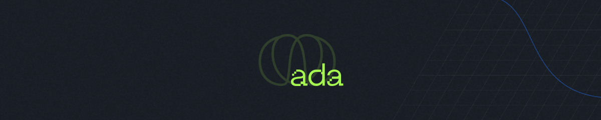

# 👩🏻‍💻📊 Ada Tech | Santander Tech+ 2024 | Data Science

Este repositório contém os projetos desenvolvidos durante o curso de Data Science, uma parceria entre a Ada Tech e o Santander Open Academy. O curso tem um total de 22 horas e é dividido em vários módulos, cada um focado em um aspecto fundamental da ciência de dados.

## Módulos do Curso

O curso é composto pelos seguintes módulos:

- **Módulo I: Cálculo básico**
- **Módulo II: Introdução ao Python**
- **Módulo III: Análise Exploratória de Dados**
- **Módulo IV: Privacidade e segurança - desafios éticos na análise de dados**
- **Módulo V: Banco de dados**
- **Módulo VI: SQL**

Cada módulo é projetado para construir uma base sólida em Data Science, começando com conceitos básicos de programação e avançando para técnicas mais complexas.

